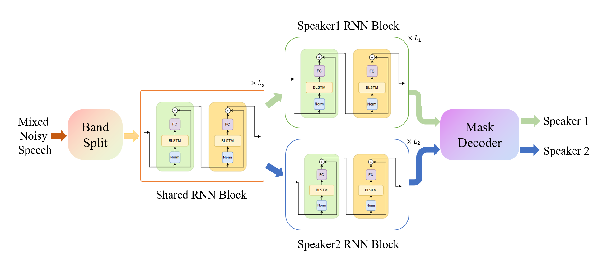
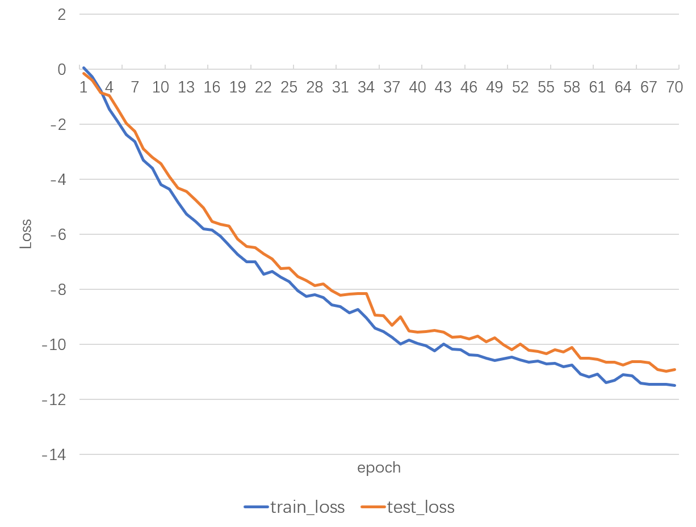

# Speech Preprocess

A repo for a solution to denoising and separating for two-speeker-mixed noisy speech, using a [BSRNN](https://arxiv.org/abs/2209.15174) inspired deep learning network.

View demos [here](https://harsh-lawyer-1d0.notion.site/Speech-Preprocess-3d33405d571840148e6b70c87edf3731?pvs=4).


## Network Architecture 💡



## Model Basics ✔️

|*Key*         | *VAlue*                  |
| ----------- | ---------------------- |
| Datasets     | AISHELL-3 & NoiseX-92 |
| FLOPs       | 2.408G                 |
| Weights Size | 61.95M                 |
| Parameters  | 16.15M                 |

<br/>

## Important Metrics 🧭
**Naive Case (only mix, no noise)**

| Metric          | SI-SNR | PESQ(wb) | PESQ(nb) | STOI  |
| --------------- | ------ | -------- | -------- | ----- |
| Raw dataset     | 0.002  | 1.240    | 1.473    | 0.681 |
| BSRNN(modified) | 12.195 | 2.453    | 2.866    | 0.901 |


**Difficult Case (with mix & noise)**

| Metric          | SI-SNR | PESQ(wb) | PESQ(nb) | STOI  |
| --------------- | ------ | -------- | -------- | ----- |
| Raw dataset     | -0.597 | 1.146    | 1.379    | 0.656 |
| BSRNN(modified) | 11.384 | 2.212    | 2.661    | 0.880 |

<br/>

## Test & Train 🚂
Python version is 3.8. Requirements can be installed by:
```
pip install -r requirements.txt
```
See [this](https://github.com/ludlows/PESQ) if installing the dependency `pesq` fails.

### Test
Modify `config/test.yml` with your own dataset path, and run following command:
```
python speech-preprocess/test.py
```

### Train
Follow the order in `data/index_data.py` and `data/make_data.py` to config your raw dataset. 
Then run following commands to make index and generate data:
```
python data/index_data.py
python data/make_data.py
```
For this project, [AISHELL-3](https://www.aishelltech.com/aishell_3) and [NoiseX-92](https://github.com/speechdnn/Noises) datasets are used.

Then, modify the config file `config/train.yml` and run following command:
```
python speech-preprocess/train.py
```

## Training Visualization 📉

